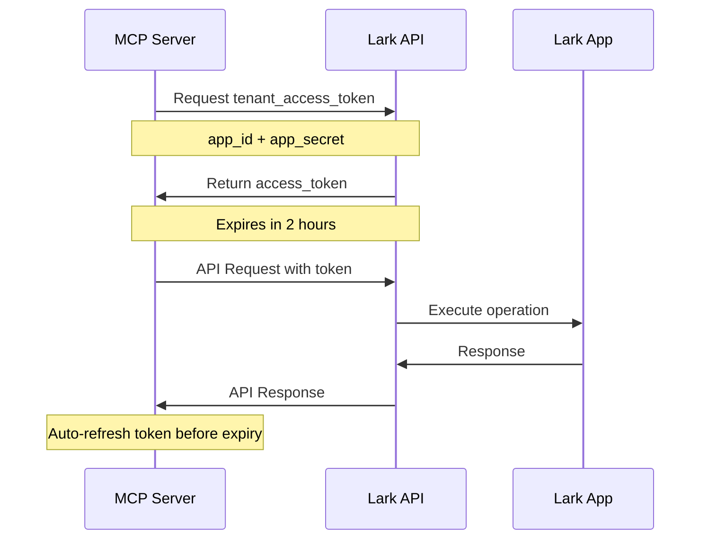

# 📋 Technical Specification: Lark MCP n8n Automation

## 🏗️ System Architecture

### Overview
The Lark MCP n8n Automation system provides a standardized bridge between AI agents and Lark Suite services through the Model Context Protocol (MCP), enabling sophisticated automation workflows via n8n.

### Component Stack
```
┌─────────────────────────────────────────────────────────────┐
│                    AI Agent Layer                           │
│  ┌─────────────┐  ┌─────────────┐  ┌─────────────┐         │
│  │Claude Desktop│  │   Cursor    │  │Custom Agents│         │
│  └─────────────┘  └─────────────┘  └─────────────┘         │
└─────────────────────────────────────────────────────────────┘
                           │ MCP Protocol
┌─────────────────────────────────────────────────────────────┐
│                  MCP Client Layer                           │
│  ┌─────────────────────────────────────────────────────┐   │
│  │         n8n Workflow Engine                         │   │
│  │  ┌──────────────┐  ┌──────────────┐                │   │
│  │  │ MCP Trigger  │  │   AI Agent   │                │   │
│  │  │    Node      │  │    Node      │                │   │
│  │  └──────────────┘  └──────────────┘                │   │
│  └─────────────────────────────────────────────────────┘   │
└─────────────────────────────────────────────────────────────┘
                           │ HTTP/REST
┌─────────────────────────────────────────────────────────────┐
│                   MCP Server Layer                          │
│  ┌─────────────────────────────────────────────────────┐   │
│  │         Lark MCP Server                             │   │
│  │  ┌──────────────┐  ┌──────────────┐                │   │
│  │  │Tool Registry │  │  API Client  │                │   │
│  │  └──────────────┘  └──────────────┘                │   │
│  └─────────────────────────────────────────────────────┘   │
└─────────────────────────────────────────────────────────────┘
                           │ Lark API
┌─────────────────────────────────────────────────────────────┐
│                    Lark Suite Services                      │
│  ┌───────────┐ ┌───────────┐ ┌───────────┐ ┌───────────┐   │
│  │Messenger  │ │   Base    │ │   Docs    │ │ Calendar  │   │
│  └───────────┘ └───────────┘ └───────────┘ └───────────┘   │
└─────────────────────────────────────────────────────────────┘
```

## 🔧 Technical Implementation

### 1. MCP Server Architecture

#### Core Components
```typescript
interface LarkMCPServer {
  // Core server instance
  app: Express.Application;
  larkClient: LarkApiClient;
  tools: Map<string, MCPTool>;
  
  // Configuration
  config: ServerConfig;
  
  // Methods
  setupMiddleware(): void;
  setupRoutes(): void;
  registerTools(): Promise<void>;
  handleMCPRequest(request: MCPRequest): Promise<MCPResponse>;
  executeTools(name: string, args: any): Promise<any>;
}
```

#### Tool Registration System
```typescript
interface MCPTool {
  name: string;
  description: string;
  inputSchema: JSONSchema;
  handler: (args: any) => Promise<any>;
}

// Tool registry pattern
const toolRegistry = new Map<string, MCPTool>();

// Auto-registration decorator
function registerTool(name: string, description: string, schema: JSONSchema) {
  return function(target: any, propertyKey: string, descriptor: PropertyDescriptor) {
    toolRegistry.set(name, {
      name,
      description,
      inputSchema: schema,
      handler: descriptor.value
    });
  };
}
```

### 2. Lark API Integration

#### Authentication Flow


#### API Client Configuration
```typescript
interface LarkClientConfig {
  appId: string;
  appSecret: string;
  domain: string; // https://open.larksuite.com or https://open.feishu.cn
  apiVersion: string; // Default: 'v1'
  timeout: number; // Request timeout in ms
  retryAttempts: number;
  rateLimiting: {
    requestsPerSecond: number;
    burstLimit: number;
  };
}
```

### 3. MCP Protocol Implementation

#### Request/Response Format
```typescript
// MCP Request Format
interface MCPRequest {
  jsonrpc: "2.0";
  method: string;
  params?: any;
  id: string | number;
}

// MCP Response Format
interface MCPResponse {
  jsonrpc: "2.0";
  result?: any;
  error?: MCPError;
  id: string | number;
}

// Tool Execution Request
interface ToolCallRequest extends MCPRequest {
  method: "tools/call";
  params: {
    name: string;
    arguments: Record<string, any>;
  };
}
```

#### Supported MCP Methods
```typescript
enum MCPMethods {
  // Core protocol
  INITIALIZE = "initialize",
  PING = "ping",
  
  // Tool management
  TOOLS_LIST = "tools/list",
  TOOLS_CALL = "tools/call",
  
  // Resource management (future)
  RESOURCES_LIST = "resources/list",
  RESOURCES_READ = "resources/read"
}
```

### 4. n8n Integration Patterns

#### MCP Trigger Node Configuration
```json
{
  "name": "Lark MCP Trigger",
  "type": "n8n-nodes-langchain.mcpTrigger",
  "parameters": {
    "endpoint": "http://localhost:3000/mcp",
    "authentication": "bearerAuth",
    "tools": ["send_lark_message", "create_lark_base_record"],
    "maxConcurrency": 5,
    "timeout": 30000
  }
}
```

#### Workflow Template Structure
```typescript
interface N8NWorkflowTemplate {
  name: string;
  description: string;
  nodes: WorkflowNode[];
  connections: NodeConnection[];
  settings: WorkflowSettings;
  
  // MCP-specific metadata
  mcpTools: string[];
  requiredCredentials: string[];
  version: string;
}
```

## 🔍 API Reference

### 1. Lark MCP Tools

#### send_lark_message
```typescript
interface SendMessageParams {
  chatId: string;        // Chat ID or user email
  message: string;       // Message content
  messageType?: 'text' | 'post' | 'card'; // Default: 'text'
}

interface SendMessageResponse {
  success: boolean;
  messageId: string;
  chatId: string;
  timestamp?: number;
}
```

#### create_lark_base_record
```typescript
interface CreateRecordParams {
  appToken: string;      // Lark Base app token
  tableId: string;       // Table ID within the app
  fields: Record<string, any>; // Field values
}

interface CreateRecordResponse {
  success: boolean;
  recordId: string;
  fields: Record<string, any>;
  revision?: number;
}
```

#### search_lark_messages
```typescript
interface SearchMessagesParams {
  query: string;         // Search query
  chatId?: string;       // Optional chat filter
  timeRange?: '1d' | '7d' | '30d' | '90d'; // Default: '7d'
  limit?: number;        // Max results (default: 20)
}

interface SearchMessagesResponse {
  success: boolean;
  messages: LarkMessage[];
  total: number;
  hasMore: boolean;
}
```

#### create_lark_document
```typescript
interface CreateDocumentParams {
  title: string;         // Document title
  content: string;       // Document content (markdown/rich text)
  folderId?: string;     // Optional folder placement
  type?: 'doc' | 'sheet' | 'mindnote'; // Default: 'doc'
}

interface CreateDocumentResponse {
  success: boolean;
  documentId: string;
  title: string;
  url: string;
  revision?: number;
}
```

#### schedule_lark_calendar_event
```typescript
interface ScheduleEventParams {
  title: string;         // Event title
  startTime: string;     // ISO 8601 format
  endTime: string;       // ISO 8601 format
  attendees?: string[];  // Email addresses
  description?: string;  // Optional description
  location?: string;     // Optional location
  reminder?: number;     // Minutes before event
}

interface ScheduleEventResponse {
  success: boolean;
  eventId: string;
  title: string;
  startTime: string;
  endTime: string;
  meetingUrl?: string;
}
```

### 2. Error Handling

#### Error Code Mapping
```typescript
enum LarkErrorCodes {
  // Authentication errors
  INVALID_APP_ID = 99991400,
  INVALID_TOKEN = 99991401,
  TOKEN_EXPIRED = 99991402,
  
  // Permission errors
  INSUFFICIENT_PERMISSIONS = 99991403,
  API_NOT_ALLOWED = 99991404,
  USER_NOT_FOUND = 99991405,
  
  // Rate limiting
  RATE_LIMITED = 99991406,
  QUOTA_EXCEEDED = 99991407,
  
  // Content errors
  MESSAGE_TOO_LONG = 99991663,
  INVALID_CONTENT_TYPE = 99991664,
  
  // Server errors
  INTERNAL_ERROR = 99991500,
  SERVICE_UNAVAILABLE = 99991501
}

interface ErrorResponse {
  code: number;
  message: string;
  retryable: boolean;
  retryAfter?: number; // Seconds
}
```

## 🔒 Security Specifications

### 1. Authentication & Authorization

#### Token Management
```typescript
interface TokenManager {
  getTenantAccessToken(): Promise<string>;
  refreshToken(): Promise<void>;
  isTokenValid(): boolean;
  getTokenExpiry(): Date;
}

// Auto-refresh strategy
const TOKEN_REFRESH_BUFFER = 300; // 5 minutes before expiry
```

#### API Security Headers
```typescript
const securityHeaders = {
  'Content-Type': 'application/json',
  'Authorization': 'Bearer {tenant_access_token}',
  'X-Request-ID': '{unique_request_id}',
  'User-Agent': 'lark-mcp-server/1.0.0'
};
```

### 2. Rate Limiting

#### Implementation Strategy
```typescript
interface RateLimiter {
  // Per-endpoint limits
  limits: Map<string, RateLimit>;
  
  // Request tracking
  requests: Map<string, RequestCounter>;
  
  // Methods
  isAllowed(endpoint: string): boolean;
  getRemainingQuota(endpoint: string): number;
  getResetTime(endpoint: string): Date;
}

interface RateLimit {
  requestsPerMinute: number;
  burstLimit: number;
  windowSize: number; // milliseconds
}
```

### 3. Data Validation

#### Input Sanitization
```typescript
// JSON Schema validation for all inputs
const messageSchema = {
  type: 'object',
  properties: {
    chatId: { 
      type: 'string', 
      pattern: '^(oc_|om_|[a-zA-Z0-9._%+-]+@[a-zA-Z0-9.-]+\.[a-zA-Z]{2,})$'
    },
    message: { 
      type: 'string', 
      maxLength: 10000,
      minLength: 1
    }
  },
  required: ['chatId', 'message']
};
```

## 📊 Performance Specifications

### 1. Response Time Requirements

| Operation | Target Response Time | Max Response Time |
|-----------|---------------------|-------------------|
| Send Message | < 500ms | < 2s |
| Create Record | < 1s | < 5s |
| Search Messages | < 2s | < 10s |
| Create Document | < 3s | < 15s |
| Schedule Event | < 1s | < 5s |

### 2. Throughput Specifications

| Metric | Target | Maximum |
|--------|--------|---------|
| Concurrent Connections | 100 | 500 |
| Requests per Second | 50 | 200 |
| Memory Usage | < 512MB | < 1GB |
| CPU Usage | < 50% | < 80% |

### 3. Scalability Considerations

#### Horizontal Scaling
```typescript
interface ScalingConfig {
  // Load balancing
  instances: number;
  loadBalancer: 'round-robin' | 'least-connections' | 'ip-hash';
  
  // Session management
  sessionStickiness: boolean;
  sharedCache: boolean;
  
  // Auto-scaling
  minInstances: number;
  maxInstances: number;
  cpuThreshold: number;
  memoryThreshold: number;
}
```

## 🧪 Testing Strategy

### 1. Unit Tests
```typescript
describe('LarkMCPServer', () => {
  describe('sendLarkMessage', () => {
    it('should send text message successfully', async () => {
      const params = {
        chatId: 'test@example.com',
        message: 'Hello, World!',
        messageType: 'text'
      };
      
      const result = await server.sendLarkMessage(params);
      
      expect(result.success).toBe(true);
      expect(result.messageId).toBeDefined();
    });
  });
});
```

### 2. Integration Tests
```typescript
describe('Lark API Integration', () => {
  it('should authenticate successfully', async () => {
    const token = await larkClient.getAccessToken();
    expect(token).toBeDefined();
    expect(token.length).toBeGreaterThan(0);
  });
});
```

### 3. Load Tests
```typescript
// Artillery.js configuration
const loadTestConfig = {
  target: 'http://localhost:3000',
  phases: [
    { duration: 60, arrivalRate: 10 }, // Warm up
    { duration: 300, arrivalRate: 50 }, // Sustained load
    { duration: 60, arrivalRate: 100 } // Peak load
  ],
  scenarios: [
    {
      name: 'Send Message',
      weight: 70,
      flow: [
        { post: { url: '/mcp', json: { /* MCP request */ } } }
      ]
    }
  ]
};
```

## 🚀 Deployment Specifications

### 1. Environment Requirements

#### Minimum System Requirements
- **CPU**: 2 cores
- **RAM**: 4GB
- **Storage**: 10GB SSD
- **Network**: 100Mbps
- **Node.js**: v16.0.0+

#### Recommended Production Setup
- **CPU**: 4+ cores
- **RAM**: 8GB+
- **Storage**: 50GB+ SSD
- **Network**: 1Gbps+
- **Load Balancer**: Nginx/HAProxy
- **Monitoring**: Prometheus + Grafana

### 2. Docker Configuration
```dockerfile
FROM node:18-alpine

WORKDIR /app

COPY package*.json ./
RUN npm ci --only=production

COPY . .

EXPOSE 3000

HEALTHCHECK --interval=30s --timeout=3s --start-period=5s --retries=3 \
  CMD curl -f http://localhost:3000/health || exit 1

USER node

CMD ["npm", "start"]
```

### 3. Kubernetes Deployment
```yaml
apiVersion: apps/v1
kind: Deployment
metadata:
  name: lark-mcp-server
spec:
  replicas: 3
  selector:
    matchLabels:
      app: lark-mcp-server
  template:
    metadata:
      labels:
        app: lark-mcp-server
    spec:
      containers:
      - name: server
        image: lark-mcp-server:latest
        ports:
        - containerPort: 3000
        env:
        - name: LARK_APP_ID
          valueFrom:
            secretKeyRef:
              name: lark-credentials
              key: app-id
        resources:
          requests:
            memory: "256Mi"
            cpu: "250m"
          limits:
            memory: "512Mi"
            cpu: "500m"
```

## 📈 Monitoring & Observability

### 1. Metrics Collection
```typescript
interface Metrics {
  // Request metrics
  requestCount: Counter;
  requestDuration: Histogram;
  requestErrors: Counter;
  
  // Lark API metrics
  larkApiCalls: Counter;
  larkApiErrors: Counter;
  larkApiDuration: Histogram;
  
  // System metrics
  memoryUsage: Gauge;
  cpuUsage: Gauge;
  activeConnections: Gauge;
}
```

### 2. Health Check Endpoint
```typescript
interface HealthCheck {
  status: 'healthy' | 'degraded' | 'unhealthy';
  timestamp: string;
  uptime: number;
  version: string;
  dependencies: {
    larkApi: 'up' | 'down';
    database?: 'up' | 'down';
    cache?: 'up' | 'down';
  };
  metrics: {
    requestRate: number;
    errorRate: number;
    responseTime: number;
  };
}
```

## 🔄 Version History & Roadmap

### Current Version: 1.0.0
- ✅ Core MCP server implementation
- ✅ 5 essential Lark tools
- ✅ n8n integration support
- ✅ Claude Desktop compatibility
- ✅ Basic authentication & security

### Roadmap v1.1.0
- 🔄 Advanced Lark tools (approval workflows, file management)
- 🔄 Resource provider support
- 🔄 Enhanced error handling
- 🔄 Performance optimizations

### Roadmap v1.2.0
- 🔄 Multi-tenant support
- 🔄 Advanced analytics
- 🔄 Plugin architecture
- 🔄 GraphQL API support

### Roadmap v2.0.0
- 🔄 Real-time event streaming
- 🔄 Advanced workflow orchestration
- 🔄 AI-powered auto-configuration
- 🔄 Enterprise SSO integration

---

*This technical specification is a living document and will be updated as the system evolves.* 