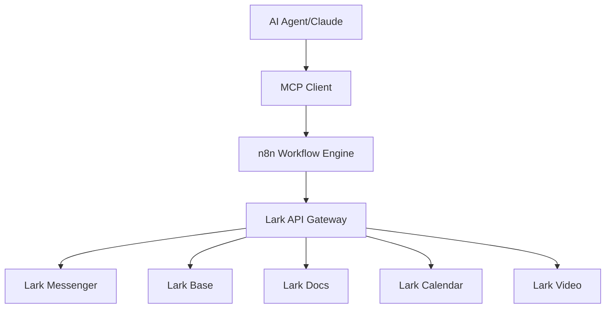

# 🚀 Lark Suite (Lark) + MCP + n8n Integration Guide

## 📱 Overview: Building Powerful Automation with Lark

**Lark Suite** (now called **Lark**) is ByteDance's comprehensive collaboration platform that combines messaging, video conferencing, calendar, docs, and more. With **MCP (Model Context Protocol)** and **n8n**, you can create sophisticated AI-powered automation workflows.

### 🎯 What You Can Achieve

- **AI-powered document processing** in Lark Docs
- **Automated team collaboration** via Lark Messenger  
- **Smart task management** with Lark Base (database)
- **Intelligent meeting scheduling** with Lark Calendar
- **Custom AI workflows** that span multiple Lark services

---

## 🏗️ Architecture Overview



---

## 🛠️ Setup Guide

### 1. **Lark App Configuration**

#### Create Lark Custom App
1. **Go to Lark Open Platform**:
   - **Global**: https://open.larksuite.com/
   - **China**: https://open.feishu.cn/

2. **Create New App**:
   ```json
   {
     "app_name": "n8n-mcp-automation",
     "app_type": "custom_app",
     "permissions": [
       "im:message",
       "im:message.group_at_msg",
       "bitable:app",
       "docx:document",
       "calendar:calendar"
     ]
   }
   ```

3. **Get Credentials**:
   - **App ID**: `cli_xxxxxxxxx`
   - **App Secret**: `xxxxxxxxxxxxx`

#### Required API Permissions
```javascript
// Essential Lark API scopes
const REQUIRED_SCOPES = [
  // Messaging
  'im:message',                    // Send/receive messages
  'im:message.group_at_msg',      // Group mentions
  'im:chat',                      // Chat management
  
  // Lark Base (Database)
  'bitable:app',                  // App management
  'bitable:app:readonly',         // Read data
  'bitable:record',               // Record operations
  
  // Documents
  'docx:document',                // Document access
  'docx:document:readonly',       // Read documents
  
  // Calendar
  'calendar:calendar',            // Calendar access
  'calendar:calendar:readonly',   // Read calendar
  
  // Users & Contacts
  'contact:user.id:readonly',     // User info
  'contact:contact:readonly'      // Contact list
];
```

### 2. **n8n Lark Integration Setup**

#### Install Lark Nodes
```bash
# If using n8n cloud - nodes are pre-installed
# If self-hosting, ensure you have the latest version

# Verify Lark nodes are available
docker exec n8n n8n --version
```

#### Configure Lark Credentials in n8n
```javascript
// Lark Authentication Configuration
{
  "name": "Lark API",
  "type": "larkApi",
  "data": {
    "authType": "oAuth2",
    "grantType": "authorizationCode",
    "clientId": "{{APP_ID}}",
    "clientSecret": "{{APP_SECRET}}",
    "authUrl": "https://open.larksuite.com/open-apis/authen/v1/index",
    "tokenUrl": "https://open.larksuite.com/open-apis/authen/v1/oidc/access_token",
    "scope": "im:message bitable:app docx:document"
  }
}
```

### 3. **MCP Server Setup with n8n**

#### Create MCP-Enabled n8n Workflow
```javascript
// n8n Workflow: Lark MCP Server
{
  "name": "Lark MCP Server",
  "nodes": [
    {
      "name": "MCP Server Trigger",
      "type": "n8n-nodes-langchain.mcpTrigger",
      "parameters": {
        "authentication": "bearerAuth",
        "options": {}
      }
    },
    {
      "name": "Lark Message Tool",
      "type": "n8n-nodes-base.lark",
      "parameters": {
        "resource": "message",
        "operation": "send",
        "chatId": "={{$json.chatId}}",
        "messageType": "text",
        "message": "={{$json.message}}"
      }
    },
    {
      "name": "Lark Base Tool", 
      "type": "n8n-nodes-base.larkBase",
      "parameters": {
        "resource": "record",
        "operation": "create",
        "appToken": "={{$json.appToken}}",
        "tableId": "={{$json.tableId}}",
        "fields": "={{$json.fields}}"
      }
    }
  ]
}
```

#### MCP Tools Configuration
```typescript
// Define MCP tools for Lark integration
interface LarkMCPTools {
  sendMessage: {
    name: "send_lark_message";
    description: "Send message to Lark chat or user";
    inputSchema: {
      chatId: string;
      message: string;
      messageType: "text" | "post" | "card";
    };
  };
  
  createBaseRecord: {
    name: "create_lark_base_record";
    description: "Create record in Lark Base table";
    inputSchema: {
      appToken: string;
      tableId: string;
      fields: Record<string, any>;
    };
  };
  
  createDocument: {
    name: "create_lark_document";
    description: "Create new Lark document";
    inputSchema: {
      title: string;
      content: string;
      folderId?: string;
    };
  };
  
  scheduleCalendarEvent: {
    name: "schedule_lark_calendar_event";
    description: "Create calendar event in Lark";
    inputSchema: {
      title: string;
      startTime: string;
      endTime: string;
      attendees: string[];
      description?: string;
    };
  };
}
```

---

## 🔧 Integration Examples

### 1. **AI-Powered Team Assistant**

#### n8n Workflow: Smart Team Assistant
```javascript
{
  "name": "Lark AI Team Assistant",
  "nodes": [
    {
      "name": "MCP Trigger",
      "type": "n8n-nodes-langchain.mcpTrigger"
    },
    {
      "name": "AI Agent",
      "type": "n8n-nodes-langchain.agent",
      "parameters": {
        "model": {
          "model": "claude-3-5-sonnet-20241022"
        },
        "systemMessage": "You are a helpful team assistant that can manage Lark messages, documents, and calendar events."
      }
    },
    {
      "name": "Route Action",
      "type": "n8n-nodes-base.if",
      "parameters": {
        "conditions": {
          "string": [
            {
              "value1": "={{$json.action}}",
              "operation": "equal",
              "value2": "send_message"
            }
          ]
        }
      }
    },
    {
      "name": "Send Lark Message",
      "type": "n8n-nodes-base.lark",
      "parameters": {
        "resource": "message",
        "operation": "send"
      }
    },
    {
      "name": "Update Lark Base",
      "type": "n8n-nodes-base.larkBase",
      "parameters": {
        "resource": "record",
        "operation": "create"
      }
    }
  ]
}
```

### 2. **Document Processing Automation**

#### Workflow: AI Document Processor
```typescript
// Document processing with AI analysis
const documentProcessor = {
  trigger: "webhook", // Triggered when document is shared
  
  steps: [
    {
      name: "Get Document Content",
      type: "lark-docs",
      operation: "getContent"
    },
    {
      name: "AI Analysis",
      type: "openai",
      operation: "analyze",
      prompt: "Analyze this document and extract key insights, action items, and create a summary"
    },
    {
      name: "Create Summary Document", 
      type: "lark-docs",
      operation: "create",
      title: "AI Summary: {{originalTitle}}",
      content: "{{aiAnalysis}}"
    },
    {
      name: "Notify Team",
      type: "lark-messenger", 
      operation: "sendMessage",
      message: "📄 Document analysis complete: {{summaryLink}}"
    },
    {
      name: "Update Project Tracker",
      type: "lark-base",
      operation: "createRecord",
      fields: {
        "Document": "{{originalTitle}}",
        "Status": "Analyzed", 
        "AI Summary": "{{summaryLink}}",
        "Action Items": "{{extractedActionItems}}"
      }
    }
  ]
};
```

### 3. **Meeting Intelligence System**

#### Workflow: Smart Meeting Assistant
```javascript
{
  "name": "Lark Meeting Intelligence",
  "description": "AI-powered meeting management",
  "nodes": [
    {
      "name": "Calendar Event Trigger",
      "type": "n8n-nodes-base.larkCalendar",
      "parameters": {
        "triggerOn": "eventStarted"
      }
    },
    {
      "name": "Pre-Meeting Preparation",
      "type": "n8n-nodes-base.function",
      "parameters": {
        "functionCode": `
          // Gather meeting context
          const attendees = items[0].json.attendees;
          const agenda = items[0].json.description;
          
          // Prepare AI context
          return [{
            json: {
              context: 'Meeting about to start',
              attendees: attendees,
              agenda: agenda,
              needsPrep: true
            }
          }];
        `
      }
    },
    {
      "name": "Send Pre-Meeting Brief",
      "type": "n8n-nodes-base.lark",
      "parameters": {
        "resource": "message",
        "operation": "send",
        "messageType": "card",
        "cardContent": {
          "header": "🎯 Meeting Starting Soon",
          "elements": [
            {
              "type": "div",
              "text": "Agenda: {{$json.agenda}}"
            },
            {
              "type": "action",
              "actions": [
                {
                  "type": "button", 
                  "text": "Join Meeting",
                  "url": "{{$json.meetingUrl}}"
                }
              ]
            }
          ]
        }
      }
    }
  ]
}
```

---

## 🔌 Advanced MCP Integration

### Custom MCP Server for Lark
```typescript
// Advanced MCP server implementation
import { McpServer } from '@modelcontextprotocol/server';
import { LarkApiClient } from '@lark/lark-api-client';

class LarkMCPServer extends McpServer {
  private larkClient: LarkApiClient;
  
  constructor(appId: string, appSecret: string) {
    super();
    this.larkClient = new LarkApiClient({
      appId,
      appSecret
    });
  }
  
  // Register Lark tools
  async registerTools() {
    await this.registerTool({
      name: 'lark_search_messages',
      description: 'Search messages in Lark chats',
      inputSchema: {
        type: 'object',
        properties: {
          query: { type: 'string' },
          chatId: { type: 'string' },
          timeRange: { type: 'string' }
        }
      }
    });
    
    await this.registerTool({
      name: 'lark_create_task',
      description: 'Create task in Lark Base',
      inputSchema: {
        type: 'object',
        properties: {
          title: { type: 'string' },
          assignee: { type: 'string' },
          dueDate: { type: 'string' },
          priority: { type: 'string' }
        }
      }
    });
  }
  
  // Handle tool calls
  async handleToolCall(name: string, args: any) {
    switch (name) {
      case 'lark_search_messages':
        return await this.searchMessages(args);
      case 'lark_create_task':
        return await this.createTask(args);
      default:
        throw new Error(`Unknown tool: ${name}`);
    }
  }
  
  private async searchMessages(args: any) {
    // Implementation for message search
    const response = await this.larkClient.im.message.list({
      container_id: args.chatId,
      query: args.query
    });
    return response.data;
  }
  
  private async createTask(args: any) {
    // Implementation for task creation
    const response = await this.larkClient.bitable.appTableRecord.create({
      app_token: process.env.LARK_BASE_APP_TOKEN,
      table_id: process.env.LARK_TASKS_TABLE_ID,
      fields: {
        'Title': args.title,
        'Assignee': args.assignee,
        'Due Date': args.dueDate,
        'Priority': args.priority
      }
    });
    return response.data;
  }
}
```

### Claude Desktop Configuration
```json
{
  "mcpServers": {
    "lark-automation": {
      "command": "node",
      "args": ["path/to/lark-mcp-server.js"],
      "env": {
        "LARK_APP_ID": "your_app_id",
        "LARK_APP_SECRET": "your_app_secret"
      }
    }
  }
}
```

---

## 🎯 Use Cases & Examples

### 1. **Customer Support Automation**
```yaml
Workflow: AI Customer Support
Trigger: New message in support channel
Actions:
  - Analyze message sentiment
  - Search knowledge base
  - Generate AI response
  - Create ticket in Lark Base
  - Route to appropriate team member
```

### 2. **Project Management Intelligence**
```yaml
Workflow: Smart Project Updates
Trigger: Daily at 9 AM
Actions:
  - Gather project status from Lark Base
  - Generate AI summary
  - Create status report document
  - Send to project stakeholders
  - Update dashboard
```

### 3. **Meeting Minutes Automation** 
```yaml
Workflow: AI Meeting Minutes
Trigger: Calendar event ends
Actions:
  - Process meeting recording/transcript
  - Extract key decisions and action items
  - Create structured minutes document
  - Assign action items to team members
  - Schedule follow-up reminders
```

---

## 🔒 Security & Best Practices

### Authentication & Authorization
```typescript
// Secure token management
const securityConfig = {
  tokenRotation: {
    enabled: true,
    intervalHours: 24
  },
  permissions: {
    principle: "least_privilege",
    scopes: ["im:message", "bitable:app", "docx:document"]
  },
  rateLimiting: {
    requestsPerMinute: 100,
    burstLimit: 200
  }
};
```

### Error Handling
```javascript
// Robust error handling for Lark API
const handleLarkApiError = (error) => {
  const errorMappings = {
    99991400: "App not authorized",
    99991401: "Tenant access token invalid", 
    99991663: "Message too long",
    99991405: "User not found"
  };
  
  return {
    code: error.code,
    message: errorMappings[error.code] || error.msg,
    retryable: [99991500, 99991501].includes(error.code)
  };
};
```

---

## 📊 Monitoring & Analytics

### Workflow Performance Tracking
```typescript
// Monitor MCP server performance
interface WorkflowMetrics {
  totalExecutions: number;
  averageExecutionTime: number;
  errorRate: number;
  popularTools: string[];
  userSatisfaction: number;
}

// Example monitoring setup
const monitoringConfig = {
  logLevel: "info",
  metrics: {
    enabled: true,
    endpoint: "/metrics",
    interval: "1m"
  },
  alerting: {
    errorThreshold: 0.05,
    responseTimeThreshold: "5s"
  }
};
```

---

## 🚀 Getting Started Checklist

### Prerequisites
- [ ] Lark workspace with admin access
- [ ] n8n instance (cloud or self-hosted)
- [ ] MCP-compatible AI client (Claude Desktop, etc.)
- [ ] Basic understanding of APIs and workflows

### Setup Steps
1. [ ] Create Lark custom app and get credentials
2. [ ] Configure Lark permissions and scopes
3. [ ] Set up n8n Lark authentication
4. [ ] Create basic MCP server workflow in n8n
5. [ ] Test connection with AI client
6. [ ] Build and deploy your first automation workflow

### Advanced Configuration
- [ ] Set up custom MCP server (optional)
- [ ] Configure advanced error handling
- [ ] Implement monitoring and analytics
- [ ] Create custom Lark tools for specific use cases

---

## 📚 Resources & Documentation

### Official Documentation
- **Lark Open Platform**: https://open.larksuite.com/document
- **n8n Documentation**: https://docs.n8n.io/
- **MCP Specification**: https://spec.modelcontextprotocol.io/

### Code Examples & SDKs
- **Lark SDK (Go)**: https://github.com/go-lark/lark
- **n8n MCP Integration**: https://docs.n8n.io/integrations/builtin/core-nodes/n8n-nodes-langchain.mcptrigger/
- **Lark API Reference**: https://open.larksuite.com/document/server-docs/

### Community & Support
- **n8n Community Forum**: https://community.n8n.io/
- **Lark Developer Community**: https://open.larksuite.com/community
- **MCP GitHub**: https://github.com/modelcontextprotocol

---

## 🎉 Next Steps

With this integration, you can now:

1. **Build AI-powered workflows** that span multiple Lark services
2. **Automate routine tasks** using natural language commands
3. **Create intelligent assistants** for your team
4. **Scale automation** across your entire organization

The combination of Lark's comprehensive collaboration tools, n8n's powerful workflow engine, and MCP's standardized AI integration creates endless possibilities for automation and intelligence in your workspace.

**Ready to start building?** Begin with the basic setup and gradually add more sophisticated workflows as you become familiar with the platform capabilities! 